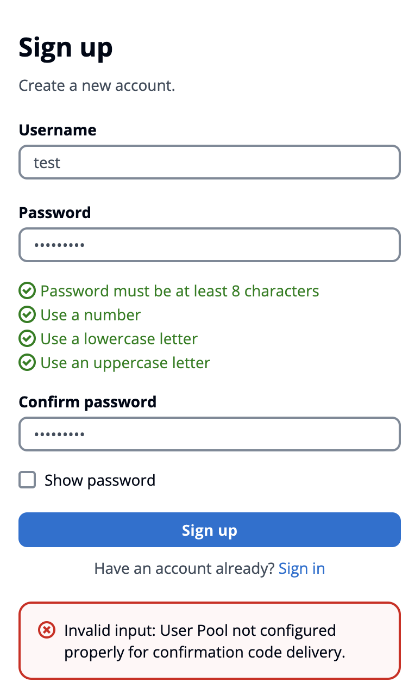

# Cloud Billing Portal: Automated Billing Statement Generation for Cloud Services

The Cloud Billing Portal is a serverless application that automates the generation of PDF billing statements for cloud services. It provides a secure, user-friendly interface for uploading billing data, processing it, and generating customized billing statements.

This application leverages AWS services to create a scalable and efficient solution for managing cloud billing processes. It consists of a frontend web interface for user interactions and a backend serverless architecture for data processing and PDF generation.

Key features include:
- Secure user authentication using AWS Cognito
- File upload functionality to an S3 bucket
- Serverless backend processing using AWS Lambda
- PDF billing statement generation with customizable information
- RESTful API for seamless communication between frontend and backend

## Repository Structure

```
.
├── CloudBillingPortal/
│   ├── __init__.py
│   ├── app.py              # Lambda function handler
│   ├── genStatement.py     # PDF generation logic
│   ├── myBillAcc.py        # Billing account processing
│   └── myPdf.py            # PDF creation utilities
├── CloudBillingPortalFrontendBucket/
│   ├── additional-info.js  # Additional information form handling
│   ├── aws-cognito.js      # AWS Cognito authentication
│   ├── file-upload.js      # File upload functionality
│   ├── index.html          # Main HTML file
│   └── styles.css          # CSS styles
├── events/
│   └── event.json          # Sample Lambda event for testing
├── deploy.sh               # Deployment script
├── delete.sh               # Delete stack script
├── template.yaml           # AWS SAM template
└── README.md
```

## Usage Instructions

### Installation

Prerequisites:
- AWS CLI (configured with appropriate permissions)
- AWS SAM CLI
- Python 3.13 (for Lambda function)
- [OPTIONAL] Node.js and npm (for frontend development)

Steps:
1. Create a project folder
2. Run sam-init:
   ```
   sam init
   ```
3. Type `2` for Custom Template Location, then for location, input this repo:
   ```
   https://github.com/john-ng-hk/CloudBillingPortal.git
   ```
4. Deploy the application:
   ```
   ./deploy.sh
   ```

   This script will build the SAM application, deploy it to AWS, and update the frontend files with the necessary configuration.
5. You will then create a user account to access the portal. Go to AWS management console --> Amazon Cognito --> User pools --> Your User Pool --> App clients --> Your App Client
   
6. Select the Login pages tab and then click View login Page
   
7. Create an account as guided, ignore the error message after sign-up
   
8. Return to AWS mgmt console and confirm the created user in your user pool
   
### Getting Started

1. After deployment, access the frontend website using the URL provided in the CloudFormation outputs.

2. Log in using the credentials provided by your administrator (managed through AWS Cognito).

3. Upload billing data files (.xlsx format) using the file upload interface.

4. Fill out the additional information form with details such as company name, address, and invoice date.

5. Submit the form to generate the PDF billing statement.

6. Download the generated PDF from the provided link.

### Configuration

The application can be configured by modifying the following files:
- `template.yaml`: AWS SAM template for infrastructure configuration
- `CloudBillingPortal/app.py`: Lambda function settings
- `CloudBillingPortalFrontendBucket/aws-cognito.js`: Cognito configuration

### Testing & Quality

To test the Lambda function locally:

1. Use the provided `events/event.json` file:
   ```
   sam local invoke CloudBillingPortalFunction -e events/event.json
   ```

2. For frontend testing, serve the `CloudBillingPortalFrontendBucket` directory using a local web server and test the functionality in your browser.

### Delete
To delete the stack, simply run the delete script `./delete.sh`

### Troubleshooting

1. Issue: File upload fails
   - Check AWS credentials and S3 bucket permissions
   - Ensure the correct bucket name is set in `file-upload.js`
   - Verify CORS configuration in the S3 bucket settings

2. Issue: PDF generation fails
   - Check Lambda function logs in AWS CloudWatch
   - Verify that all required parameters are being passed correctly from the frontend
   - Ensure the Lambda function has the necessary permissions to access S3 and other resources

3. Issue: Authentication fails
   - Verify Cognito User Pool and Identity Pool settings in AWS Console
   - Check that the correct Cognito configuration is set in `aws-cognito.js`
   - Ensure the user is registered and confirmed in the Cognito User Pool

For debugging:
- Enable verbose logging in the Lambda function by modifying the log level
- Use browser developer tools to debug frontend issues and network requests

## Data Flow

The Cloud Billing Portal follows this data flow:

1. User Authentication: The user logs in through the Cognito User Pool.
2. User Authorization: The user then get their rights through Cognito Identity Pool and IAM Role
3. File Upload: Authenticated users upload billing data files to the backend S3 bucket.
4. Add additional information: User submits additional billing information via the frontend form, frontend then makes an API call to the API Gateway
5. Lambda Processing: API Gateway triggers the Lambda function, Lambda function processes the billing data from S3, lastly Lambda generates a PDF billing statement
6. Statement Delivery: PDF is returned to the frontend as a base64-encoded string, Frontend provides a download link for the generated PDF


## Deployment

The application is deployed using the `deploy.sh` script, which performs the following steps:

1. Builds the SAM application
2. Deploys the SAM application to AWS
3. Retrieves CloudFormation outputs
4. Updates frontend JavaScript files with configuration values
5. Copies frontend files to the S3 bucket for hosting

To deploy updates:
1. Make necessary changes to the code
2. Run `./deploy.sh`

## Infrastructure

The Cloud Billing Portal uses the following AWS resources:

- S3:
  - CloudBillingPortalBackendBucket: Stores uploaded CSV files
  - CloudBillingPortalFrontendBucket: Hosts the frontend website

- Lambda:
  - CloudBillingPortalFunction: Processes billing data and generates PDF statements

- API Gateway:
  - CloudBillingPortalAPIGateway: Exposes the /statement endpoint

- Cognito:
  - CloudBillingPortalUserpool: Manages user authentication
  - CloudBillingPortalIdentityPool: Manages user authorization

- IAM:
  - CloudBillingPortalIAMAuthRole: Grants authenticated users access to the backend S3 bucket

These resources are defined and managed using AWS SAM in the `template.yaml` file.